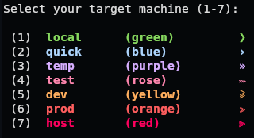

# Shell Environments

## Setup
> [!IMPORTANT]
> Retrieve the latest init.sh and execute it using `/bin/sh`
```sh
wget -O - https://raw.githubusercontent.com/run2go/shell/main/init.sh | sh
```

## Preset colors & symbols
> 

## Aliases Overview
| Alias | Command |
| --- | --- |
| cl | clear |
| s | ss -tlnu |
| f | fzf |
| r | ranger |
| c | cat/batcat |
| v | vi/vim |
| g | lazygit |
| d | lazydocker |
| pa | docker/podman ps -a |

## _sh (minimal & robust)_
A minimal shell script that leverages the `~/.profile` file.<br>
- Timestamps
- Advanced prompt

## _bash (lightweight & fast)_
A small shell script that updates the `~/.bashrc` file.<br>
- Timestamps
- Expressive prompt
- Color support
- Terminal titles

## _zsh (advanced & interactive)_
Advanced shell with interactive functionality.<br>
- Timestamps
- Interactive prompt
- Color support
- Terminal titles
- Interactive auto completion
- Yazi file manager
- Zoxide CD substitute
